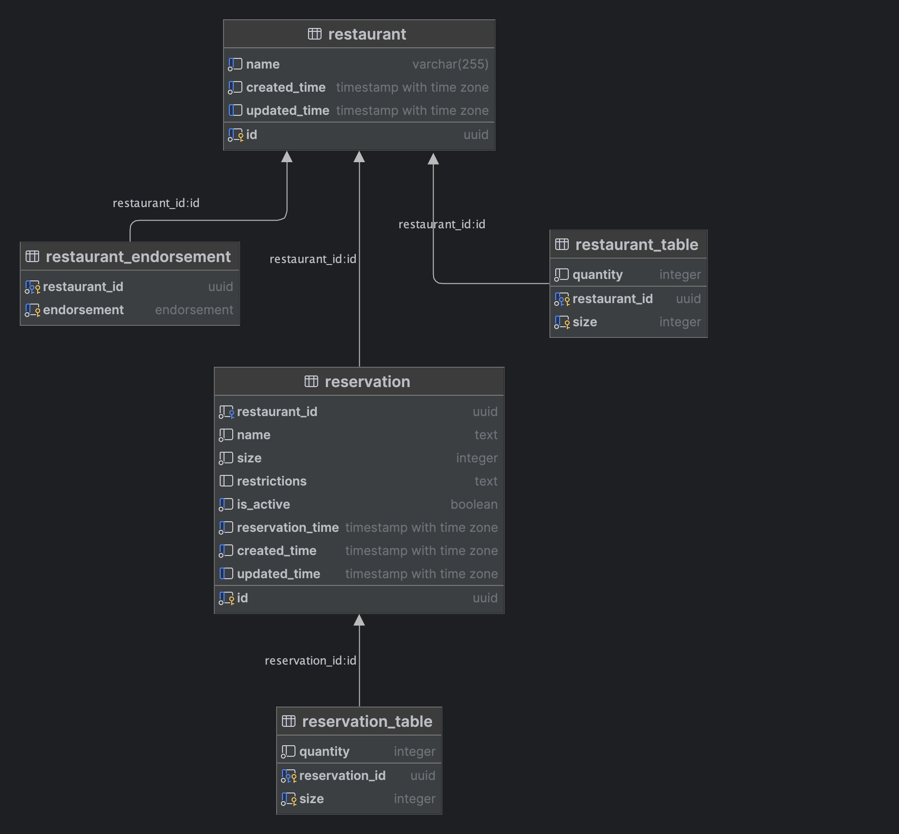

# Restaurant Booking Service Solution

Build a Web Service that implements endpoints to find a restaurant, create and delete reservations.

## Technical Requirements

### API

We need to implement at a minimum, 3 endpoints,

- Find Restaurants matching criteria
    - Has available seats to accommodate
        - Group SIZE
        - between TIME and TIME + 2 HOURS
    - Has ALL the specified ENDORSEMENTS, ignored if empty
- Create a Reservation
- Delete a Reservation

### Data

#### User Input for finding a restaurant

- Name
- Group Size
- Dietary Restrictions
- Reservation Time

#### Storage

Given scope and scale, a relational database such as PostgreSQL is appropriate.
We need tables to represent the different entities and their relationships.

#### Tables

Since the scope does not include authentication and user management, we can exclude that from the data model and provide
user preferences as parameters to the endpoints. Therefore, we have the following entities.

A Restaurant has both Tables and Endorsements. A Reservation has Tables.
We don't need to know the Endorsements of a Reservation since it is used to match a restaurant and we can get that from the Restaurant.

- restaurant
- restaurant endorsement
- restaurant table
- reservation
- reservation table

## Solution

GraphQL API written in Kotlin using the Quarkus framework and the PostgresSQL database.

## Data Model

Since this service does not implement authentication, there was no need to have a user table.
User's name and Restrictions are provided during booking of tables.



## SQL

Some of the SQL is inline in the DAO and some are included from the resources folder.
In some cases, the SQL is templated using [stringtemplate4](https://github.com/antlr/stringtemplate4/blob/master/doc/templates.md).
[Cheatsheet](https://github.com/antlr/stringtemplate4/blob/master/doc/cheatsheet.md).

Originally, this project began using Hibernate ORM and Panache. However, that made it nearly impossible to write custom sql queries.
[The switch](https://github.com/bkuberek/kotlin-quarkus-booking-service-demo/pull/1) to [Quarkus-Jdbi](https://github.com/quarkiverse/quarkus-jdbi) made all the difference in completing this project.


### Total Restaurant Capacity

In the following query `size` is the type of table and `capacity` is the number of tables of that type.

```postgresql
SELECT r.id,
       r.name,
       rt.size,
       SUM(rt.quantity)           as capacity,
       rt.size * SUM(rt.quantity) AS seats
FROM restaurant AS r
         INNER JOIN restaurant_table AS rt ON rt.restaurant_id = r.id
GROUP BY 1, 2, 3
ORDER BY 2, 3;
```

| id                                   | name                     | size | capacity | seats |
|:-------------------------------------|:-------------------------|:-----|:---------|:------|
| c52e1d11-757a-48dc-88e8-4bf9866ca53a | Falling Piano Brewing Co | 2    | 5        | 10    |
| c52e1d11-757a-48dc-88e8-4bf9866ca53a | Falling Piano Brewing Co | 4    | 5        | 20    |
| c52e1d11-757a-48dc-88e8-4bf9866ca53a | Falling Piano Brewing Co | 6    | 5        | 30    |
| 635dc3bd-c515-4d41-848b-bc487bb13810 | Lardo                    | 2    | 4        | 8     |
| 635dc3bd-c515-4d41-848b-bc487bb13810 | Lardo                    | 4    | 2        | 8     |
| 635dc3bd-c515-4d41-848b-bc487bb13810 | Lardo                    | 6    | 1        | 6     |
| dfe2cab1-6a39-4426-8937-c1d89403e0f0 | Panadería Rosetta        | 2    | 3        | 6     |
| dfe2cab1-6a39-4426-8937-c1d89403e0f0 | Panadería Rosetta        | 4    | 2        | 8     |
| dfe2cab1-6a39-4426-8937-c1d89403e0f0 | Panadería Rosetta        | 6    | 0        | 0     |
| b1e6728c-da7c-4841-bbf3-ba7e97f7e07c | Tetetlán                 | 2    | 2        | 4     |
| b1e6728c-da7c-4841-bbf3-ba7e97f7e07c | Tetetlán                 | 4    | 4        | 16    |
| b1e6728c-da7c-4841-bbf3-ba7e97f7e07c | Tetetlán                 | 6    | 1        | 6     |
| d42c8608-7d52-4ea3-823f-c59b68a33407 | u.to.pi.a                | 2    | 2        | 4     |
| d42c8608-7d52-4ea3-823f-c59b68a33407 | u.to.pi.a                | 4    | 0        | 0     |
| d42c8608-7d52-4ea3-823f-c59b68a33407 | u.to.pi.a                | 6    | 0        | 0     |

Filter results by dietary restrictions

```postgresql
SELECT r.id,
       r.name,
       rt.size,
       SUM(rt.quantity)           as capacity,
       rt.size * SUM(rt.quantity) AS seats
FROM restaurant AS r
         INNER JOIN restaurant_table AS rt ON rt.restaurant_id = r.id
         LEFT JOIN restaurant_endorsement AS re ON re.restaurant_id = r.id
WHERE re.endorsement IN ('vegan', 'vegetarian')
GROUP BY 1, 2, 3
ORDER BY 2, 3;
```

| id                                   | name              | size | capacity | seats |
|:-------------------------------------|:------------------|:-----|:---------|:------|
| dfe2cab1-6a39-4426-8937-c1d89403e0f0 | Panadería Rosetta | 2    | 3        | 6     |
| dfe2cab1-6a39-4426-8937-c1d89403e0f0 | Panadería Rosetta | 4    | 2        | 8     |
| dfe2cab1-6a39-4426-8937-c1d89403e0f0 | Panadería Rosetta | 6    | 0        | 0     |
| d42c8608-7d52-4ea3-823f-c59b68a33407 | u.to.pi.a         | 2    | 4        | 8     |
| d42c8608-7d52-4ea3-823f-c59b68a33407 | u.to.pi.a         | 4    | 0        | 0     |
| d42c8608-7d52-4ea3-823f-c59b68a33407 | u.to.pi.a         | 6    | 0        | 0     |

Restaurant Capacity by table size

```postgresql
SELECT sub.id,
       sub.name,
       sub.endorsements,
       rt.size,
       SUM(rt.quantity)           as capacity,
       rt.size * SUM(rt.quantity) AS seats
FROM (SELECT r.id,
             r.name,
             ARRAY_AGG(re.endorsement) AS endorsements
      FROM restaurant AS r
               LEFT JOIN restaurant_endorsement AS re ON re.restaurant_id = r.id
      GROUP BY 1, 2) AS sub
         INNER JOIN restaurant_table AS rt ON rt.restaurant_id = sub.id
GROUP BY 1, 2, 3, 4
ORDER BY 2, 3;
```

| id                                   | name                     | endorsements        | size | capacity | seats |
|:-------------------------------------|:-------------------------|:--------------------|:-----|:---------|:------|
| c52e1d11-757a-48dc-88e8-4bf9866ca53a | Falling Piano Brewing Co | {}                  | 2    | 5        | 10    |
| c52e1d11-757a-48dc-88e8-4bf9866ca53a | Falling Piano Brewing Co | {}                  | 4    | 5        | 20    |
| c52e1d11-757a-48dc-88e8-4bf9866ca53a | Falling Piano Brewing Co | {}                  | 6    | 5        | 30    |
| 635dc3bd-c515-4d41-848b-bc487bb13810 | Lardo                    | {gluten}            | 2    | 4        | 8     |
| 635dc3bd-c515-4d41-848b-bc487bb13810 | Lardo                    | {gluten}            | 4    | 2        | 8     |
| 635dc3bd-c515-4d41-848b-bc487bb13810 | Lardo                    | {gluten}            | 6    | 1        | 6     |
| dfe2cab1-6a39-4426-8937-c1d89403e0f0 | Panadería Rosetta        | {gluten,vegetarian} | 2    | 3        | 6     |
| dfe2cab1-6a39-4426-8937-c1d89403e0f0 | Panadería Rosetta        | {gluten,vegetarian} | 4    | 2        | 8     |
| dfe2cab1-6a39-4426-8937-c1d89403e0f0 | Panadería Rosetta        | {gluten,vegetarian} | 6    | 0        | 0     |
| b1e6728c-da7c-4841-bbf3-ba7e97f7e07c | Tetetlán                 | {gluten,paleo}      | 2    | 2        | 4     |
| b1e6728c-da7c-4841-bbf3-ba7e97f7e07c | Tetetlán                 | {gluten,paleo}      | 4    | 4        | 16    |
| b1e6728c-da7c-4841-bbf3-ba7e97f7e07c | Tetetlán                 | {gluten,paleo}      | 6    | 1        | 6     |
| d42c8608-7d52-4ea3-823f-c59b68a33407 | u.to.pi.a                | {vegan,vegetarian}  | 2    | 2        | 4     |
| d42c8608-7d52-4ea3-823f-c59b68a33407 | u.to.pi.a                | {vegan,vegetarian}  | 4    | 0        | 0     |
| d42c8608-7d52-4ea3-823f-c59b68a33407 | u.to.pi.a                | {vegan,vegetarian}  | 6    | 0        | 0     |

This query lists restaurants, their endorsements and total capacity.
In this case total capacity is the number of people the venue can accommodate.

```postgresql
SELECT sub.id,
       sub.name,
       sub.endorsements,
       SUM(rt.size * rt.quantity) AS total_capacity
FROM (SELECT r.id,
             r.name,
             ARRAY_AGG(re.endorsement) AS endorsements
      FROM restaurant AS r
               LEFT JOIN restaurant_endorsement AS re ON re.restaurant_id = r.id
      GROUP BY 1, 2) AS sub
         INNER JOIN restaurant_table AS rt ON rt.restaurant_id = sub.id
GROUP BY 1, 2, 3
ORDER BY total_capacity;
```

| id                                   | name                     | endorsements        | total\_capacity |
|:-------------------------------------|:-------------------------|:--------------------|:----------------|
| d42c8608-7d52-4ea3-823f-c59b68a33407 | u.to.pi.a                | {vegan,vegetarian}  | 4               |
| dfe2cab1-6a39-4426-8937-c1d89403e0f0 | Panadería Rosetta        | {gluten,vegetarian} | 14              |
| 635dc3bd-c515-4d41-848b-bc487bb13810 | Lardo                    | {gluten}            | 22              |
| b1e6728c-da7c-4841-bbf3-ba7e97f7e07c | Tetetlán                 | {gluten,paleo}      | 26              |
| c52e1d11-757a-48dc-88e8-4bf9866ca53a | Falling Piano Brewing Co | {}                  | 60              |

## Find Reserved Capacity

We have determined that a reservation lasts 2 hours. We are looking for how many tables are booked within 2 hours prior
of TIME.
These are tables that are still in use.

List of restaurant IDs and their current booked capacity between (TIME - 2 hours) and TIME.

```postgresql
-- INPUT TIME: 2024-08-03 21:00:00.000000 +00:00
-- Looking between (TIME - 2) and TIME
SELECT b.restaurant_id,
       bt.size,
       SUM(bt.quantity) as occupied
FROM reservation AS b
         INNER JOIN restaurant AS r ON b.restaurant_id = r.id
         INNER JOIN reservation_table AS bt ON bt.reservation_id = b.id
WHERE b.reservation_time > '2024-08-03 19:00:00.000000 +00:00'
  AND b.reservation_time <= '2024-08-03 21:00:00.000000 +00:00'
GROUP BY 1, 2;
```

| restaurant\_id                       | size | occupied |
|:-------------------------------------|:-----|:---------|
| 635dc3bd-c515-4d41-848b-bc487bb13810 | 6    | 1        |
| b1e6728c-da7c-4841-bbf3-ba7e97f7e07c | 2    | 1        |
| c52e1d11-757a-48dc-88e8-4bf9866ca53a | 2    | 1        |
| c52e1d11-757a-48dc-88e8-4bf9866ca53a | 6    | 1        |
| d42c8608-7d52-4ea3-823f-c59b68a33407 | 2    | 2        | <-- 2 x size 2 tables
| dfe2cab1-6a39-4426-8937-c1d89403e0f0 | 4    | 1        |

### Challenges

If user `A` wants to book at 7pm. At 7pm at the table is available, however,
there is an existing reservation for a table at 7:15. This would cause a conflict.
The existing reservation holder for 7:15 will arrive and potentially not have a table.

#### Proposals

Also check in the future that the table capacity is still available.

```sql
-- Existing reservation starts within `time_start` and `time_stop`
(b.reservation_time >= :time_start AND b.reservation_time < :time_stop)
OR 
-- Existing reservation + `INTERVAL` is between `time_start` and `time_stop`
(b.reservation_time + INTERVAL :time_interval >= :time_start AND b.reservation_time + INTERVAL :time_interval < :time_stop)
```

**Update:** this is the current implementation.

## Find Available Capacity

Building on top of the previous queries, we can now subtract occupied from total, and we have available tables.

```postgresql
WITH venue AS (SELECT r.id,
                      rt.size,
                      SUM(rt.quantity) as capacity
               FROM restaurant AS r
                        INNER JOIN restaurant_table AS rt ON rt.restaurant_id = r.id
               GROUP BY 1, 2),
     booked AS (SELECT b.restaurant_id  AS id,
                       bt.size,
                       SUM(bt.quantity) as occupied
                FROM reservation AS b
                         INNER JOIN restaurant AS r ON b.restaurant_id = r.id
                         INNER JOIN reservation_table AS bt ON bt.reservation_id = b.id
                WHERE b.reservation_time >= '2024-08-04 19:00:00.000000 +00:00'
                  AND b.reservation_time < '2024-08-04 21:00:00.000000 +00:00'
                GROUP BY 1, 2)

SELECT venue.id,
       venue.size,
       COALESCE(venue.capacity, 0)                                AS capacity,
       COALESCE(booked.occupied, 0)                               AS occupied,
       COALESCE(venue.capacity, 0) - COALESCE(booked.occupied, 0) AS available
FROM venue
         LEFT JOIN booked on (booked.id = venue.id AND booked.size = venue.size)
ORDER BY 1, 2
```

| id                                   | size | capacity | occupied | available |
|:-------------------------------------|:-----|:---------|:---------|:----------|
| 635dc3bd-c515-4d41-848b-bc487bb13810 | 2    | 4        | 0        | 4         |
| 635dc3bd-c515-4d41-848b-bc487bb13810 | 4    | 2        | 0        | 2         |
| 635dc3bd-c515-4d41-848b-bc487bb13810 | 6    | 1        | 1        | 0         |
| b1e6728c-da7c-4841-bbf3-ba7e97f7e07c | 2    | 2        | 1        | 1         |
| b1e6728c-da7c-4841-bbf3-ba7e97f7e07c | 4    | 4        | 0        | 4         |
| b1e6728c-da7c-4841-bbf3-ba7e97f7e07c | 6    | 1        | 0        | 1         |
| c52e1d11-757a-48dc-88e8-4bf9866ca53a | 2    | 5        | 1        | 4         |
| c52e1d11-757a-48dc-88e8-4bf9866ca53a | 4    | 5        | 0        | 5         |
| c52e1d11-757a-48dc-88e8-4bf9866ca53a | 6    | 5        | 1        | 4         |
| d42c8608-7d52-4ea3-823f-c59b68a33407 | 2    | 2        | 2        | 0         |
| d42c8608-7d52-4ea3-823f-c59b68a33407 | 4    | 0        | 0        | 0         |
| d42c8608-7d52-4ea3-823f-c59b68a33407 | 6    | 0        | 0        | 0         |
| dfe2cab1-6a39-4426-8937-c1d89403e0f0 | 2    | 3        | 0        | 3         |
| dfe2cab1-6a39-4426-8937-c1d89403e0f0 | 4    | 2        | 1        | 1         |
| dfe2cab1-6a39-4426-8937-c1d89403e0f0 | 6    | 0        | 0        | 0         |


## Find Available Tables at a Restaurant

```postgresql
WITH venue AS (SELECT r.id,
                      rt.size,
                      SUM(rt.quantity) as capacity
               FROM restaurant AS r
                        INNER JOIN restaurant_table AS rt ON rt.restaurant_id = r.id
               WHERE r.id = :restaurant_id
               GROUP BY 1, 2),
     endorsing AS (SELECT r.id,
                          re.endorsement
                   FROM restaurant AS r
                            INNER JOIN restaurant_endorsement AS re ON re.restaurant_id = r.id
                   WHERE r.id = :restaurant_id
                   GROUP BY 1, 2),
     booked AS (SELECT b.restaurant_id  AS id,
                       bt.size,
                       SUM(bt.quantity) as occupied
                FROM reservation AS b
                         INNER JOIN restaurant AS r ON b.restaurant_id = r.id
                         INNER JOIN reservation_table AS bt ON bt.reservation_id = b.id
                WHERE r.id = :restaurant_id
                  AND (
                    (b.reservation_time >= :time_start AND b.reservation_time < :time_stop)
                        OR (b.reservation_time + INTERVAL :time_interval >= :time_start AND
                            b.reservation_time + INTERVAL :time_interval < :time_stop)
                    )
                GROUP BY 1, 2)

SELECT sub.id,
       rr.name,
       sub.size,
       sub.total,
       sub.occupied,
       sub.available,
       sub.available_seats,
       ARRAY_REMOVE(ARRAY_AGG(endorsing.endorsement), NULL) as endorsements
FROM (SELECT venue.id,
             venue.size,
             COALESCE(venue.capacity, 0)                                               AS total,
             COALESCE(booked.occupied, 0)                                              AS occupied,
             COALESCE(venue.capacity, 0) - COALESCE(booked.occupied, 0)                AS available,
             venue.size * (COALESCE(venue.capacity, 0) - COALESCE(booked.occupied, 0)) AS available_seats
      FROM venue
               LEFT JOIN booked on (booked.id = venue.id AND booked.size = venue.size)) as sub
         INNER JOIN restaurant as rr ON rr.id = sub.id
         LEFT JOIN endorsing on endorsing.id = sub.id
WHERE sub.available_seats >= :size
  AND sub.id = :restaurant_id
GROUP BY 1, 2, 3, 4, 5, 6, 7
ORDER BY 2, 3
;
```

| id                                   | name  | size | total | occupied | available | available\_seats | endorsements |
|:-------------------------------------|:------|:-----|:------|:---------|:----------|:-----------------|:-------------|
| 635dc3bd-c515-4d41-848b-bc487bb13810 | Lardo | 2    | 4     | 0        | 4         | 8                | {gluten}     |
| 635dc3bd-c515-4d41-848b-bc487bb13810 | Lardo | 4    | 2     | 0        | 2         | 8                | {gluten}     |

---

[<- Previous (Problem)](./problem.md)
| [Next (Running the Application) -> ](./running.md)
